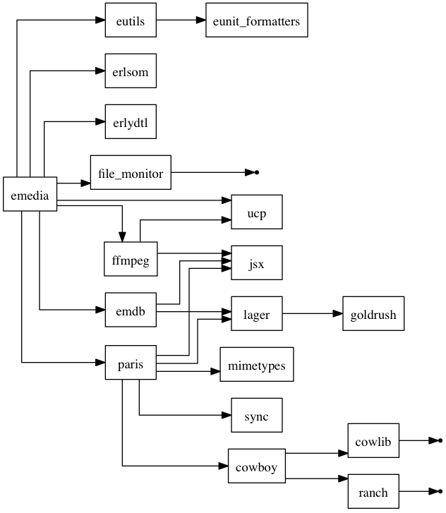

# Rebar Deps Graph

Generate a dependency graph with [Rebar](https://github.com/rebar/rebar).

## Install

In your `rebar.config`, add the following lines :

```
{deps, [{rebar_deps_graph, ".*",
         {git, "git://github.com/emedia-project/rebar_deps_graph"}}]}.

{plugins, [deps_graph_plugin] }.
```

That's all ;)

> This plugin has been tested with `rebar` 2.3.0.

## Usage

While the plugin is _installed_, you can use the command :

```
rebar graph-deps [graph=<file>]
```

Attribute `graph` allow you to specify an output file. If not present, the result will be send on the standard output.

The output is a [Graphviz](http://graphviz.org/) file.

> Before using `graph-deps` get the dependencies using `get-deps`.

## Example

The following image show the dependency graph of the [emedia](https://github.com/emedia-project/emedia) project.



An edge between a named node and a point indicate that the plugin was unable to retrieve the dependency for the given node. In this example, the dependencies for `file monitor`, `cowling` and `ranch` are unknown.

[Here](riak-deps.png) is another example for the [Riak](https://github.com/basho/riak) project.

## Licence 

This plugin is based on [mapdeps.erl](https://github.com/basho/riak/blob/develop/misc/mapdeps.erl) from Basho, licenced under the Apache License, Version 2.0. 

Copyright (c) 2013 Basho Technologies, Inc.

Modifications by Grégoire Lejeune.

This project is provided to you under the Apache License, Version 2.0 (the "License"); you may not use this file except in compliance with the License. You may obtain a copy of the License at

[http://www.apache.org/licenses/LICENSE-2.0](http://www.apache.org/licenses/LICENSE-2.0)

Unless required by applicable law or agreed to in writing, software distributed under the License is distributed on an "AS IS" BASIS, WITHOUT WARRANTIES OR CONDITIONS OF ANY KIND, either express or implied. See the License for the specific language governing permissions and limitations under the License.


